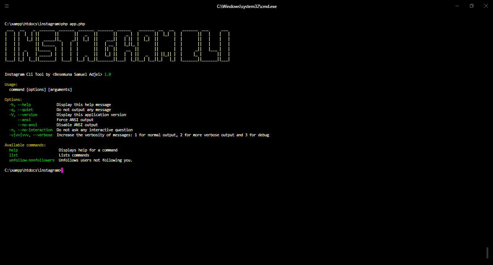

# Instagram Cli Tool
A php cli based program that performs handy repetitve instagram actions. It directly talks to the instagram server without the need for an api. 

# Motivation
I definatley needed to stop wasting time on the gram! My actions were repeatitive so i automated it 🤖.

# Technologies used
The package is built with **php** specifically the [symfony console component](https://github.com/symfony/console).

# Installation
To Install the package, first pull from this repository.
```bat
git clone https://github.com/besemuna/instagram-cli
```
After cd into the directory and install dependencies.
```bat
cd instagram-cli && composer install
```

# Screenshot
The main page of the app.


# Documentation
```bat
php app.php unfollow-nonfollowers 
```
For more, hit the [docs!](documentation)

# To Do
Here's where we are so far.
- [x] Unfollow nonfollowers.
- [x] Unfollow from a list of users.
- [x] Select users based on query parameters, this selected list can be used to follow or unfollow the selected users.
- [x] Add white list option.
- [x] Add a realtime notification system to listen to incoming notifications - like a user just followed you.
- [ ] Add Clone followers.

# License
This project is licensed under the MIT License - see the [LICENSE FILE](LICENSE) for more details
